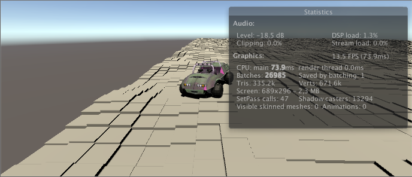

# Unity-ecs-demo

* Unity 2019.1.0f2
* Preview Packages: Entities, Hybrid Renderer

# Scenes

CubeMonoECS.unity

**Yellow** using MonoBehaviour and **Green** ECS (EntityComponentSystem).

CubeMono.unity

CubeECS.unity

CarMono.unity

Press **SPACE** to spawn the car.

CarECS.unity

ECS, until now doesn't handle physics. So, the car will pass through the floor.

# Ref

* [getting-started-entity-component-system-ecs-unity-tutorial](http://gyanendushekhar.com/2018/08/01/getting-started-entity-component-system-ecs-unity-tutorial)
* [unity-ecs-survival-shooter](http://infalliblecode.com/unity-ecs-survival-shooter-part-1)
* [Car assets from Warthog.zip](http://files.holistic3d.com/Resources/Warthog.zip)